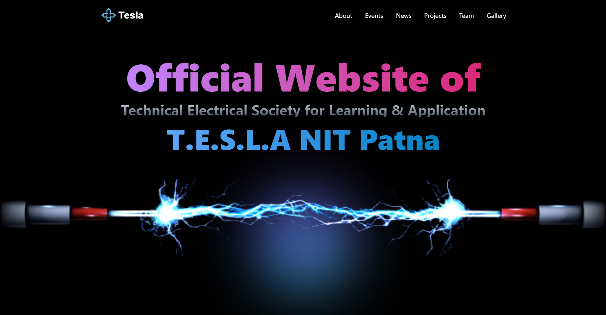

<h1 align='center'> Tesla Club NIT, Patna 🤖 </h1>
Tesla Club is the official club of electrical engineering department of NIT, Patna.


# tesla-nitp
Official website of Tesla Club NIT Patna



Project has following functionalities

1. Creating a Component in React
2. Making HTTP calls
3. Communicating between parent and child component
4. Using Basic Routing in React
5. Using SCSS, CSS and Tailwind for Styling


# Prerequisites 👨‍💻

### Install Node JS
Refer to https://nodejs.org/en/ to install nodejs

### Install vite
Install Vite npm package globally. This will help to easily run the project and also build the source files easily. Use the following command to install vite

### Learn Tailwind CSS
This project uses `Tailwind CSS` if you don't have any hands-on experience with tailwind css then you can refer to their [docs](https://tailwindcss.com/).

```bash
npm install -g vite
```
## Live WebSite URL

The WebSite is deployed in https://tesla-nitp.vercel.app/

Click on the link to see the website.

## Cloning and Running the Application in local

Clone the project into local.

Install all the npm packages. Go into the root folder and type the following command to install all npm packages

```bash
npm install
```

In order to run the application Type the following command


```bash
npm run dev
```

The Application Runs on [http://127.0.0.1:5173/](http://127.0.0.1:5173/)


`Contributions are welcome 🎉🎉`

# Ways to contribute:
1. Solve the issues which are listed
2. Create your own issue and then send PR.

Please refer to the project's style and contribution guidelines for submitting patches and additions. In general, we follow the "fork-and-pull" Git workflow.

 1. **Fork** the repo on GitHub
 2. **Clone** the project to your own machine
 3. **Commit** changes to your own branch
 4. **Push** your work back up to your fork
 5. Submit a **Pull request** so that we can review your changes


### 🚀 Please abide by  **Contributing Guidelines** and **Code of Conduct**.


## Contributors ✨

Thanks goes to these wonderful people ❤️:

<!-- ALL-CONTRIBUTORS-LIST:START - Do not remove or modify this section -->
<!-- prettier-ignore-start -->
<!-- markdownlint-disable -->
<a href = "https://github.com/SudhansuuRanjan/tesla-nitp-web/graphs/contributors">
  
</a>

<!-- markdownlint-restore -->
<!-- prettier-ignore-end -->

<!-- ALL-CONTRIBUTORS-LIST:END -->
